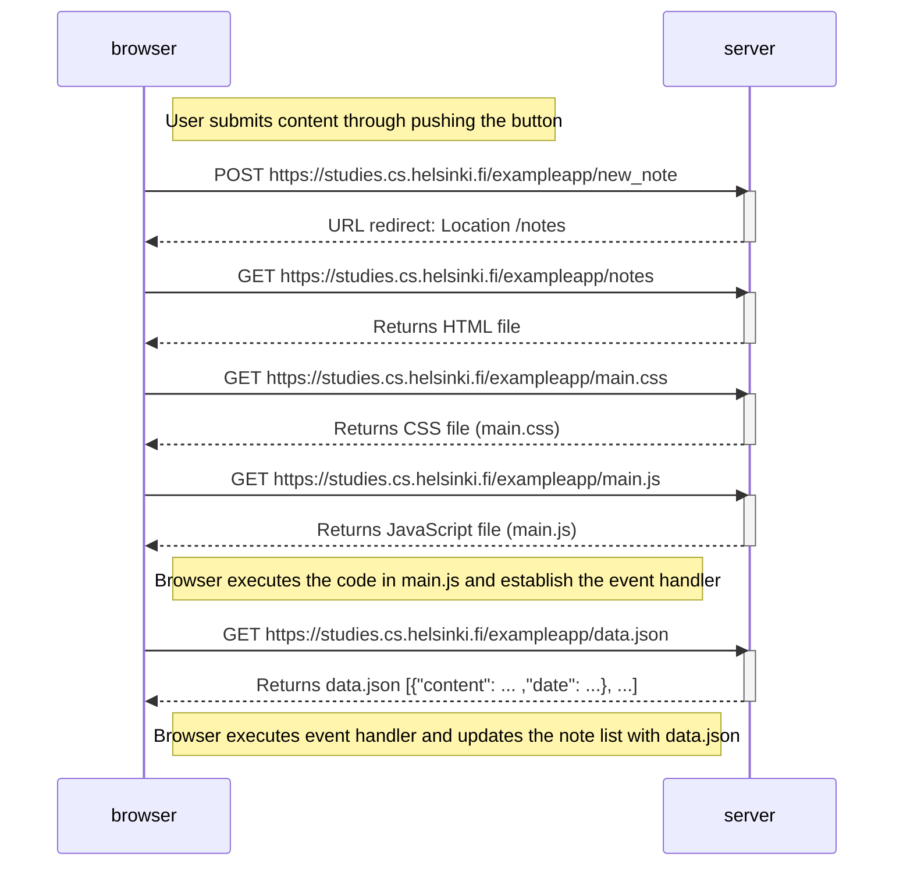

```mermaid

sequenceDiagram
    participant browser
    participant server

    note right of browser: User submits content through pushing the button 

    browser->>server: POST https://studies.cs.helsinki.fi/exampleapp/new_note
    activate server
    server-->>browser: URL redirect: Location /notes
    deactivate server

    browser ->> server: GET https://studies.cs.helsinki.fi/exampleapp/notes
    activate server
    server -->> browser: Returns HTML file
    deactivate server

    browser ->> server: GET https://studies.cs.helsinki.fi/exampleapp/main.css
    activate server
    server -->> browser: Returns CSS file (main.css)
    deactivate server

    browser ->> server : GET https://studies.cs.helsinki.fi/exampleapp/main.js
    activate server
    server -->> browser: Returns JavaScript file (main.js)
    deactivate server

    note right of browser: Browser executes the code in main.js and establish the event handler

    browser ->> server: GET https://studies.cs.helsinki.fi/exampleapp/data.json
    activate server
    server -->> browser: Returns data.json [{"content": ... ,"date": ...}, ...]
    deactivate server

    note right of browser: Browser executes event handler and updates the note list with data.json
```
