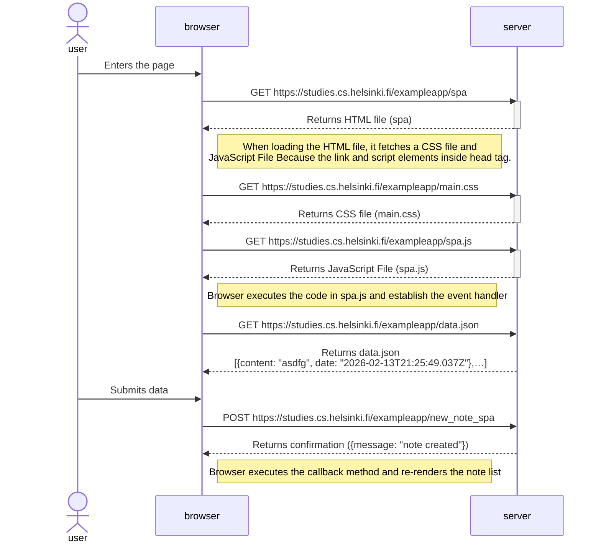

```mermaid
sequenceDiagram
        actor user
        participant browser
        participant server

        user ->>browser: Enters the page
        browser->>server: GET https://studies.cs.helsinki.fi/exampleapp/spa
        activate server
        server -->> browser: Returns HTML file (spa) 
        deactivate server
        note right of browser: When loading the HTML file, it fetches a CSS file and <br>JavaScript File Because the link and script elements inside head tag.

        browser->>server: GET https://studies.cs.helsinki.fi/exampleapp/main.css
        activate server
        server -->> browser: Returns CSS file (main.css)
        deactivate server

        browser->>server: GET https://studies.cs.helsinki.fi/exampleapp/spa.js
        activate server
        server -->> browser: Returns JavaScript File (spa.js)
        deactivate server

        note right of browser: Browser executes the code in spa.js and establish the event handler

        browser ->>server: GET https://studies.cs.helsinki.fi/exampleapp/data.json
        server -->> browser: Returns data.json <br> [{content: "asdfg", date: "2026-02-13T21:25:49.037Z"},…]


        user->>browser: Submits data
        browser->>server: POST https://studies.cs.helsinki.fi/exampleapp/new_note_spa
        server -->>browser: Returns confirmation ({message: "note created"})

        note right of browser: Browser executes the callback method and re-renders the note list
```
        

